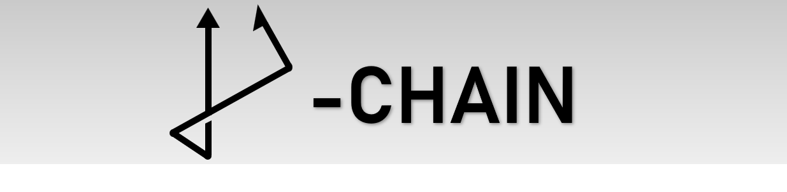
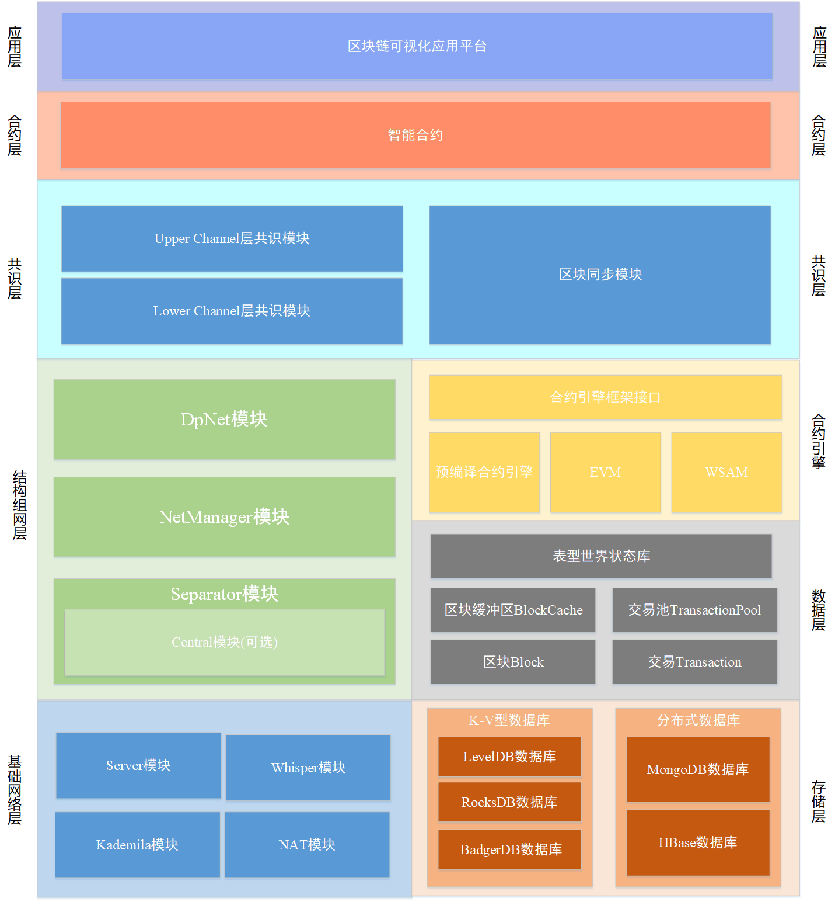

# DP-Chain V1.1.0
The main system of DP-Chain. Copyright © 2023, DP-Chain Authors. All Rights Reserved.

# Updating Panel
### 1.1.0
A big milestone! This is a stable version.

Changes are as follows.

1. The block ordering service is rewritten, and gets a good stability ever has.
2. Fatal bug about mutex when synchronizing and querying blockchain states has been fixed. 

### 1.0.9

Now here comes the v1.0.9!

The current version focuses on improving stability on the basis of previous versions：

1. Improved stability of block synchronization module.
2. Improved stability of lower level consensus module.
3. Add active block synchronization mechanism to the upper consensus module.
4. Added reconnection function for disconnected nodes.

### 1.0.1
Now here comes the v1.0.1!

In this version the system has much more features and is more stable compared with the one in v1.0.0. Changes are as follows:

1) Pipline Smart Contract Engine

In the last version, we separate the smart contract engine from the main program and use the json rpc to communicate with each other. Now, to make program much more efficient and easy to configure, we use a pipline way to enable the communication between smart contract engine and dper.

2) Log System

Log system is replaced with logrus, which can help users to debug and maintain service in a more systematical way.

3) RESTFUL Style RPC

Now dper only supports commands input in a http rpc way with the architecture of Gin (a restful style rpc architecture). 

4) Persistent Storage

Now the dpchain can store data in a persistent way, and can be restarted with the already existed data storage every time you reuse a blockchain system or solve some fatal problems that should restart nodes.

5) More Friendly Hyperparameter Settings

Hyperparameter that directly influences the system efficiency and stability is integrated in a file named coe.go, and we also allow you to use a default mode to use default hyperparameter in a safe and stable way.  

6) More Friendly deploying script

Considered that the deploying script in last few versions require python and so some packages and environment settings, we rewrite a new deploying script in dper/client/conf/initConfig.go. If you want to get a real implementation case, just run command:

    go run initConfig.go

7) System Efficiency Promotion and Debugs

We have tried to improve the system efficiency and stability in many ways include but not only include enlarging the batch of transactions in a block, using a new transactions cache strategy, and realizing the multiple transactions transmission and parsing.   

### 1.0.0
Now here comes the v1.0.0!

Following features are integrated in v1.0.0:

1) Federal Learning

Added support for federated learning. Users can deploy own federated learning projects through the external interface provided by DPChain. DPChain's zoning and hierarchical architecture greatly simplifies the deployment of federal learning programs:

Users can train their own models at any node of DPChain. DPChain will automatically call the existing consensus interface to complete the consensus within each partition, and then reach a consensus on the model between each partition through the upper consensus. In this way, the trained model on each single node can be quickly shared across the whole network.

2) Remote Smart Contract Engine

External smart contract engine module. This module communicates with DPChain through rpc socket. Users can write their own contract file and submit it to the contract engine for execution, and complete deployment on DPChain through socket communication.

3) Bloom Filter

Bloom filter is added to DPChain. It can quickly detect whether transactions or blocks exist, improving the ability of DPChain to resist flooding attacks(DDoS, junk transactions)

### 0.9.5
Now the *Repeat Transaction Risk* has been resolved by adding the transaction filter. The file path is:

    dpchain/core/eles/commonFilter.go

Now, a block with duplicate transactions (compared with previous transactions that have been already on chain) will be recognized as invalid.

Also, a transaction with lifetime 0 will be regarded as invalid if it is over 50 versions lag.

### 0.9.4
Make the demo smart contract III much more complex.
### 0.9.3
Add automated project deployment script.
### 0.9.2
Multiple kinds of experiments and debug. 
### 0.9.1
Add static reflect NAT kind.

# Congratulation
Now the first version of this DP-Chain is about to be released, all contributors should be proud of this. Thanks to all developers, and wish DP-Chain a bright future.

# What is DP-Chain

DP-Chain is a consortium blockchain system that insists on supporting Byzantine fault-tolerance. It is an efficient, easy-use and safe blockchain platform, and will be well-known in the near future.
DP-Chain has good scalability and supports more nodes to run consensus method compared with current consortium blockchain system. This feature broadens the application scenarios where user is node of DP-Chain.
DP-Chain builds a native blockchain platform system with sharding management and support shards for collaborative interaction, which avoids the performance and security degradation caused by chain-cross facilities.

# What have done
The development process of DP-Chain is more or less tough. Let's take a look at our brilliant achievements.
* P2P network construction.
* Dpnet (the network of dpchain from the application aspect) initialization and management.
* Group net separating and so the message transmission.
* Transaction pool.
* Consensus promoter (the main mode to manage the operation of dpchain).
* Lower-level consensus (which is the trimmed PBFT).
* Determine the database (for both blocks and world state data).
* Design the pre-compiled smart contract engine (should pre-remain the interface for EVM and WASM).
* Design the block cache to handle remote blocks and local blocks, which helps to do upper consensus.
* Upper-level consensus (includes order service agent and provider).
* Realize block synchronization.
* Realize three kinds demo smart contract application.
* Complete the dper, which is the basic client for users to construct and manage DP-Chain.

## MAIN LINE
* Backend tests for the three demo smart contract.
* Implementation in real distributed experimental environment.   
* Multi platform (Linux, Windows, MacOS) online test.

## TODO LIST
Here are what should be done in the future. 
#### TPBFT View Change
We should realize the view change in the lower consensus to make DP-Chain more stable and tolerant of one-fault problem.
#### Repeat Transaction Risk
At this time, transaction with 0 lifetime could be pushed into blockchain multiple times. We should design an efficient way to prevent repeated transaction from storing in blockchain.  
#### Support Multiple Booters
Now time there could be only one booter to provide block ordering service in upper-level consensus. A RAFT like block ordering service providing mechanism should be designed. It can make DP-Chain more stable and tolerant of one-fault problem.
#### Support MPT Mode
DP-Chain is significantly different from Ethereum as the former is consortium blockchain system and the other is public blockchain system. In DP-Chain we use table like data structure to store world states compared with MPT in Ethereum. Though MPT would waste lots of storage and computing resource, we still want to support MPT mode in DP-Chain. This could expand the application scenarios of DP-Chain.   

## Project Architecture
Here is the overall architecture diagram of DP-Chain.

### Basic Network layer

The basic network layer provides the bottom p2p communication service for the entire DP-Chain project. Each DP-Chain node is a p2p node in the network, so it has dual roles of server and client: the server part is realized by the Server module, which is the core module for each p2p node to realize communication. In addition to the server side for p2p communication of nodes, it also provides interfaces to support removable client modules; The client part is implemented by the Whisper module, which is a node p2p communication client based on the protocol interface provided by the Server module.

In order to quickly build the entire underlying p2p network, we adopted Kademila algorithm in DHT algorithm, which is responsible for finding other p2p nodes in the network and establishing connections with these nodes. In order to realize the network connection of devices under different internal networks, NAT modules are used to achieve internal network penetration, including UPnP protocol, NAT-PMP protocol, static file settings, NAT Hole and other methods.

### Structured Network layer

The structure network layer is based on the Basic Network layer, using the separator protocol to complete the grouping and layering of all p2p nodes. The separator protocol will divide the entire p2p network into two layers: the lower channel layer and the upper channel layer. The lower channel layer divides the entire p2p network into several node groups, each of which has a leader node and several follower nodes; The upper channel layer is also a node group,its members are the leader nodes of each node group of the lower channel layer. Besides, it also includes a special node: booter node (the booter node is used to provide boot services for other nodes at the beginning of the separator protocol,these nodes is only located in the upper channel layer).

The core of the separator protocol is the Separator module, which is called by the NetManager module of each node to complete the structure of the p2p network. After the operation of the protocol, each node can obtain the structure of the entire structured network through the DpNet module.

It should be noted that when the NetManager module calls the separator protocol for network grouping and layering, the default method is to through the way of "SelfState"( every p2p node sets its  role by itself: Booter/Leader/Follower, and then chose its own subnet group).We have also designed another centralized method, that is, the central Booter node is responsible for it, It will set roles and subnet groups for each p2p node according to user-defined profiles.

### Storage layer

For data storage, we currently use the LevelDB database, which is a high-performance K-V database. In the future, we will also introduce support for other K-V databases, and use some high-performance distributed databases to supplement the project.

### Basic Data layer

In the data layer, the most basic and important data structures are Block and Transaction, which are the main information flows running in the whole blockchain network. The higher level data structures corresponding to these two data structures are BlockCache and TransactionPool. The former is responsible for caching all the blocks obtained by the current node (including those generated locally and obtained from other nodes),and the latter is responsible for caching all the transactions obtained by the current node.These two data structures provide all necessary interfaces for the upper layer. In addition to data storage and retrieval operations, they are also responsible for retrieving and deleting long-term expired data.

Similar to Ethereum, the DP-Chain project also adopted the concept of "Account" at the beginning of design. Each node must have an account to record the current state. However, we did not use MPT(Ethereum's state tree) scheme to achieve the world state, but used a phenotype database. This is a data structure based on LevelDB, and it's perfectly compatible with existing mature database solutions, result in the system storage efficiency is significantly improved. At the same time, due to the two segment address composition scheme, the world state data is stored structurally, which makes it easier to query and call the data of smart contracts and their functions.

### Contract Engine layer

TODO:

### Consensus layer

In the consensus layer, we adopt a distributed and parallel two-layer consensus scheme. By running the separator protocol, we divided the entire network into Lower channel layer and Upper channel layer. So we also need to have two layers of consensus: First, consensus needs to be reached within each node group of the lower channel layer. After reaching the lower level consensus, the corresponding leader node submits the blocks that need global consensus to participate in the upper level consensus. Then, in the upper channel layer, the leader nodes of each partition make upper level consensus on all submitted blocks. The finally agreed blocks will be sorted by the Booter node (which is also the second role of the Booter node), broadcast to all leader nodes, and finally propagated to all nodes.

At the lower channel layer, we adopt the consensus algorithm TPBFT (trimmed practical byzantine fault tolerance), which is a consensus algorithm based on the modified implementation of PBFT. At the same time, TPBFT has a programmable feature, which divides the entire consensus process into phases, and each phase has reserved interfaces to support customization. Therefore, it can be triggered according to specific smart contracts to expand the functions and application scenarios of smart contracts; In the upper channel layer, in order to improve the reusability and scalability of the system, the consensus algorithm module in this part is pluggable. Users can deploy consensus algorithms as needed, such as common consensus algorithms : PBFT , RAFT and so on.

In the whole consensus process, the following two situations may occur: 1. The network delay of the node is too high; 2. The node joins the network as a new member. The above two kinds of situations may cause the node to be unable to successfully join the blocks which have through the consensus protocol to the local. Therefore, we must be provided to synchronize the main chain between nodes, that is, the block synchronization module in the project.

### Contract layer

TODO:

### Application layer

TODO:
